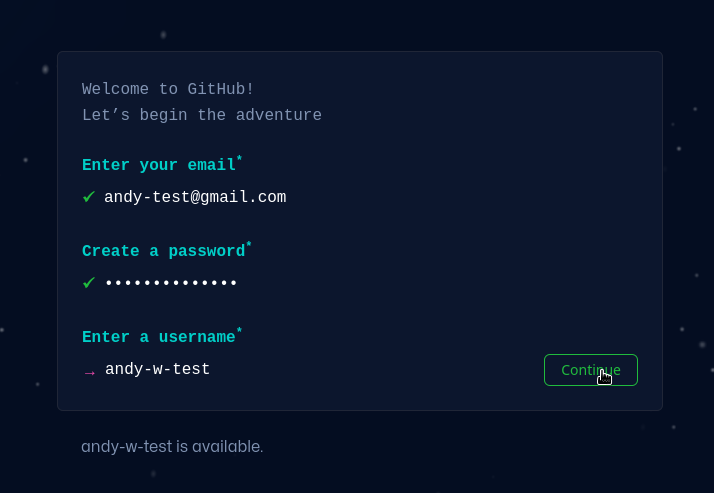

# Návod k odevzdávání úkolů

## Podrobně krok za krokem

  
0. Instalace gitu

  Jdi na <https://czechitas-podklady.cz/git-instalace/> a postupuj podle sveho operacniho systemu.

  Vice o gitu samotnem napriklad [zde](https://kodim.cz/czechitas/daweb/zaklady-gitu/uvod-do-gitu/system-git).

  
1. Založení účtu na Githubu (bylo v požadavcích kurzu, pokud nemáš, založ si teď)

  Jdi na <https://github.com/signup> a založ si nový účet.

  

  
2. Založení repozitáře (stačí jeden pro oba úkoly)

  Vytvoř si složku ve Visual Studio Code a nahraj ji na GitHub stejně, jako jsme si to ukazovali na šesté lekci. Repozitář můžeš založit jako soukromý nebo veřejný.

  Jedním způsobem jak založti repozitář je vytvořit si novou složku pro úkoly na svém počítači, otevřít si ji ve Visual Studiu Code, přihlásit se do svého účtu na GitHubu a poté složku zveřejnit jako nový repozitář

  **Video níže není natočené na operačním systému Windows, proto třeba založení složky nemusí vypada přesně jako u tebe**

  

  
3. Přidání kouče/koučky do repozitáře

  Vytvoř si složku ve Visual Studio Code a nahraj ji na GitHub stejně, jako jsme si to ukazovali na šesté lekci. Repozitář můžeš založit jako soukromý nebo veřejný.

  Přidání provedeš tak, že si otevřeš svůj repozitář na GitHubu, klikneš na `Settings`, poté na `Manage access` a tam na tlačítko `Invite a collaborator`.

  Otevře se okno, do kterého zadej e-mail nebo přihlašovací jmého konkrétního kouče nebo koučky.

  **Video níže není natočené na operačním systému Windows, proto třeba založení složky nemusí vypada přesně jako u tebe**

  

  
4. Nahrání souboru s úkolem na GitHub

  Vytvoř si soubor pro uložení ukolu (např. `ukol_1.py`) ve složce kterou máš propojenou s repozitářem na GitHubu.

  V nově otevřeném editoru napiš program. Až budeš s úkolem spokojená(ý), můžeš ho nahrát na GitHub. Nejprve klikni na ikonku `Source Control` vlevo. Poté myší najeď k nápisu `Changes`. Objeví se ikona `+`, na kterou klikneš. Tím přidáš soubor(y) do `Staged Changes`, tj. mezi soubory, které jsou určené k nahrání na Git.

  Poté zadej nějakou zprávu od okna `Message` (např. `Odevzdávám první úkol`) a klikni na tlačítko `Commit`.

  Poté můžeš kliknout `Sync Changes`, alternativně (např. pokud vidíš nějakou chybovou zprávu) můžeš kliknout na ikonu tří teček a poté vyber možnost `Push`.

  **Video níže není natočené na operačním systému Windows, proto třeba založení složky nemusí vypada přesně jako u tebe**

  

  
5. Vytvoření issue

  Poté vytvoř nové Issue ve svém repozitáři. Do názvu zadej název úkolu a v textu napiš přezdívku tvého kouče/koučky se zavináčem. Tím zajistíš, že kouč/koučka bude informován o založení issue e-mailem. Dále můžeš využít možnost `Assignees` a vybrat svého kouče/koučku. Pokud svého kouče/koučku nevidíš, je potřeba jej přidat do repozitáře, viz postup v podkapitole **Přidání kouče/koučky do repozitáře**.

  **Video níže není natočené na operačním systému Windows, proto třeba založení složky nemusí vypada přesně jako u tebe**

  

